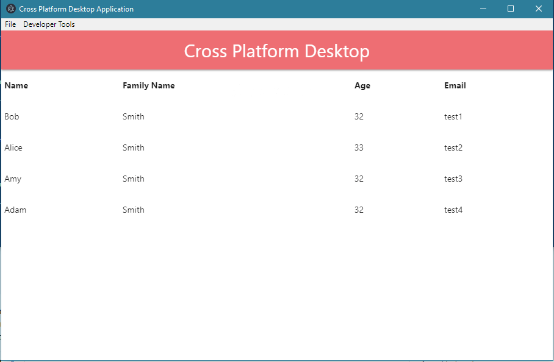

# Cross Platform Desktop Application With .Net Core 2x and Angular 6x

This project introduce simple cross platform desktop application with .Net Core 2 and Angular 6 in Electron environment.

## Implementation GUIDE

[http://atilla.tanrikulu.biz/cross-platform-desktop-application-with-netcore2x-and-angular6x/](http://atilla.tanrikulu.biz/cross-platform-desktop-application-with-netcore2x-and-angular6x/)

## Download 

Windows Version: [Download](https://github.com/atillatan/cross-platform-desktop-application-with-netcore2x-and-angular6x/raw/master/build/cross-platform-desktop-application-with-netcore2x-and-angular6x%20Setup%201.0.0.exe) 
Mac Version: [Download](https://github.com/atillatan/cross-platform-desktop-application-with-netcore2x-and-angular6x/raw/master/build/cross-platform-desktop-application-with-netcore2x-and-angular6x-1.0.0.dmg) 

